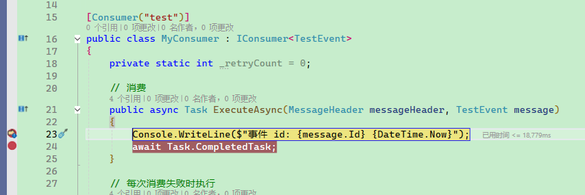

# 快速开始

在本篇教程中，将介绍 Maomi.MQ.RabbitMQ 的使用方法，以便读者能够快速了解该框架的使用方式和特点。

Maomi.MQ.RabbitMQ 是一个基于 RabbitMQ 的消息队列封装框架，提供了很多开箱即用的功能，通过简单灵活的方式简化消息传输流程，提供一系列可靠的消息传输保障机制，降低开发者使用难度，减少开发时间。

主要功能：

* 简化的消息定义和消费者，无需复杂配置即可上手
* 丰富灵活的配置，发挥 RabbitMQ 的强大力量，自动创建队列、死信队列、广播模式、Qos 并发控制、动态路由、动态消费者
* 自定义序列化器，支持 Json、Protobuf、Thrift、MessagePack 二进制消息传输，高性能压缩消息减少内存、提高并发量、跨微服务传输
* 支持自动和自定义发布消息推送交换器，支持 RabbitMQ 事务推送模式。
* 简化的消费者模式、事件总线模式、广播模式、动态消费者，还支持结合 MeditaR、FastEndpoints 框架使用，进一步减少使用负担，减少代码侵入性。
* 自定义重试策略，从容应对服务错误、强一致性消息、高并发流量。
* 支持本地消息表模式，强一致性保证业务消息不丢失，解决空悬挂、重复处理等异步消息异常问题，保证业务可靠性。
* 自由的消费者模式，除了 MeditaR、FastEndpoints，还可以自由接入其它框架，充分利用第三方框架的优质能力。


### 快速配置

创建一个 Web 项目（可参考 WebDemo 项目），引入 Maomi.MQ.RabbitMQ 包，在 Web 配置中注入服务：

```csharp
// using Maomi.MQ;
// using RabbitMQ.Client;

builder.Services.AddMaomiMQ((MqOptionsBuilder options) =>
{
    options.WorkId = 1;
    options.AppName = "myapp";
    options.Rabbit = (ConnectionFactory options) =>
    {
        options.HostName = Environment.GetEnvironmentVariable("RABBITMQ")!;
        options.Port = 5672;
        options.ClientProvidedName = Assembly.GetExecutingAssembly().GetName().Name;
    };
}, [typeof(Program).Assembly]);

var app = builder.Build();
```

<br />

* WorkId： 指定用于生成分布式雪花 id 的节点 id，默认为 0。

  > 每条消息生成一个唯一的 id，便于追踪。如果不设置雪花id，在分布式服务中，多实例并行工作时，可能会产生相同的 id。

* AppName：用于标识消息的生产者，以及在日志和链路追踪中标识消息的生产者或消费者。

* Rabbit：RabbitMQ 客户端配置，请参考 [ConnectionFactory](https://rabbitmq.github.io/rabbitmq-dotnet-client/api/RabbitMQ.Client.ConnectionFactory.html)。


定义消息模型类，模型类是 MQ 通讯的消息基础，该模型类将会被序列化为二进制内容传递到 RabbitMQ 服务器中。

```csharp
public class TestEvent
{
    public int Id { get; set; }

    public override string ToString()
    {
        return Id.ToString();
    }
}
```

<br />

定义消费者，消费者需要实现 `IConsumer<TEvent>` 接口，以及使用 `[Consumer]` 特性注解配置消费者属性，如下所示，`[Consumer("test")]` 表示该消费者订阅的队列名称是 `test`。

 `IConsumer<TEvent>` 接口有三个方法，`ExecuteAsync` 方法用于处理消息，`FaildAsync` 会在 `ExecuteAsync` 异常时立即执行，如果代码一直异常，最终会调用 `FallbackAsync` 方法，Maomi.MQ 框架会根据 ConsumerState 值确定是否将消息放回队列重新消费，或者做其它处理动作。

```csharp
[Consumer("test")]
public class MyConsumer : IConsumer<TestEvent>
{
    // 消费
    public async Task ExecuteAsync(MessageHeader messageHeader, TestEvent message)
    {
        Console.WriteLine($"事件 id: {message.Id} {DateTime.Now}");
        await Task.CompletedTask;
    }

    // 每次消费失败时执行
    public Task FaildAsync(MessageHeader messageHeader, Exception ex, int retryCount, TestEvent message) 
        => Task.CompletedTask;

    // 补偿
    public Task<ConsumerState> FallbackAsync(MessageHeader messageHeader, TestEvent? message, Exception? ex) 
        => Task.FromResult( ConsumerState.Ack);
}
```

> Maomi.MQ 还具有多种消费者模式，代码写法不一样，后续会详细讲解不同的消费者模式。

<br />

如果要发布消息，只需要注入 IMessagePublisher 服务即可。

```csharp
private readonly IMessagePublisher _messagePublisher;

public IndexController(IMessagePublisher messagePublisher)
{
	_messagePublisher = messagePublisher;
}

[HttpGet("publish")]
public async Task<string> Publisher()
{
	// 发布消息
	await _messagePublisher.PublishAsync(exchange: string.Empty, routingKey: "test", message: new TestEvent
	{
		Id = 123
	});
	return "ok";
}
```

<br />

启动 Web 服务，在 swagger 页面上请求 API 接口，MyConsumer 服务会立即接收到发布的消息。



<br />

就是这么简单，就是这么方便。


### 怎么发布消息

#### 自动发布（推荐）

虽然发布者和消费者共用一个模型类，但是在一个项目中怎么配置模型类，都不会影响消费者。将分布者消费者隔离简化框架设计和微服务解耦，支持不同的编程语言服务相互通讯，共同完成业务逻辑。

例如为了简化消息发布，我们可以在模型类指定绑定的路由键。

```csharp
[RouterKey("scenario.quickstart")]
public sealed class QuickStartMessage
{
}
```


发布时是根据模型类的 `[RouterKey]`  自动找到要推送的交换器和路由键，简化发布消息的参数。

```csharp
await _publisher.AutoPublishAsync(message);
```


当然手动设置也可以：

```csharp
await _publisher.PublishAsync(string.Empty, request.Queue, message);
```


消费者可以自由设置要消费的队列，即使是相同的模型类，可以自由设定队列名称，不会产生干扰。

```csharp
[Consumer("scenario.quickstart")]
public sealed class QuickStartConsumer : IConsumer<QuickStartMessage>
{
}
```


#### 手动发布

适用于你需要精细控制 `exchange/routingKey` 或消息属性（TTL、Header、优先级等）的场景。

```csharp
[HttpPost("publish-manual")]
public async Task<IResult> PublishManual()
{
    var message = new OrderCreatedMessage
    {
        OrderNo = "SO-20260211-002",
        Amount = 299.00m
    };

    await _publisher.PublishAsync(
        exchange: "biz.order.exchange",
        routingKey: "order.created.v1",
        message: message,
        properties: p =>
        {
            p.Expiration = "60000";
            p.Headers ??= new Dictionary<string, object?>();
            p.Headers["tenant"] = "tenant-a";
        });

    return Results.Ok(message);
}
```


但是 Maomi.MQ.RabbitMQ 提供了更为简单易用的方式，实现自动处理队列属性。

例如，要设计一个死信队列，你只需要在消费者上设置属性即可：

```csharp
[Consumer(
    "example.retry.main",
    RetryFaildRequeue = false,
    DeadExchange = "",
    DeadRoutingKey = "example.retry.dead")]
public sealed class RetryConsumer : IConsumer<RetryMessage>
{
}
```


* `RetryFaildRequeue` 表示消费失败后不会放回原队列。
* `DeadExchange` 死信交换器名称。
* `DeadRoutingKey` 死信队列路由键。


所以，发布消息时，只需要使用这两行代码：

```csharp
await _publisher.PublishAsync(string.Empty, request.Queue, message);
await _publisher.AutoPublishAsync(message);
```


<br />

### 普通消费者、动态消费者、事件总线

Maomi.MQ 支持以多种姿势创建消费者，一个项目里面可以同时使用多种消费者模式，自由而不会冲突。

这三种模式不是互斥关系，而是处理复杂度不同：

- 普通消费者：固定队列 + 固定处理器，最常用，还可以自由扩展出不同类型的消费者模式，例如 MediatR 。
- 动态消费者：运行时动态创建/停止订阅，适合从数据库加载数据动态创建消费者。
- 事件总线：一个消息触发多个有顺序的处理步骤，生成执行链和回滚链路。


#### 普通消费者模式

实现 `IConsumer<TMessage>` 接口即可，可以自定义消费、重试、回滚逻辑，这种模式使用简单，还能从容处理消息错误和回滚。

失败重试时调用 `FaildAsync`，重试耗尽进入 `FallbackAsync`。

```csharp
[Consumer("biz.order.created.v1", Qos = 10, RetryFaildRequeue = false)]
public sealed class NormalOrderConsumer : IConsumer<OrderCreatedMessage>
{
    public Task ExecuteAsync(MessageHeader messageHeader, OrderCreatedMessage message)
    {
        Console.WriteLine($"normal consume => {message.OrderNo}");
        return Task.CompletedTask;
    }

    public Task FaildAsync(MessageHeader messageHeader, Exception ex, int retryCount, OrderCreatedMessage message)
        => Task.CompletedTask;

    public Task<ConsumerState> FallbackAsync(MessageHeader messageHeader, OrderCreatedMessage? message, Exception? ex)
        => Task.FromResult(ConsumerState.Ack);
}
```


#### 动态消费者模式

你可以在运行时将业务需要订阅的消息队列动态注册，例如 SAAS 平台新建租户后需要动态按照租户前缀消费对应的主题，也可以自行取消订阅。

```csharp
public sealed class DynamicDemoService
{
    private readonly IDynamicConsumer _dynamicConsumer;

    public DynamicDemoService(IDynamicConsumer dynamicConsumer)
    {
        _dynamicConsumer = dynamicConsumer;
    }

    public async Task<string> StartAsync(string queue)
    {
        var options = new ConsumerAttribute(queue) { Qos = 5 };

        var consumerTag = await _dynamicConsumer.ConsumerAsync<OrderCreatedMessage>(
            options,
            execute: (header, message) =>
            {
                Console.WriteLine($"dynamic consume => {message.OrderNo}");
                return Task.CompletedTask;
            },
            faild: (header, ex, retryCount, message) => Task.CompletedTask,
            fallback: (header, message, ex) => Task.FromResult(ConsumerState.Ack));

        return consumerTag;
    }

    public Task StopByQueueAsync(string queue)
        => _dynamicConsumer.StopConsumerAsync(queue);
}
```


#### 事件总线模式

事件总线模式可以自由编排事件执行链路，框架会按照链路自动执行并在执行失败后自动执行回滚链路。

`IEventMiddleware<T>` 负责构建执行链，`[EventOrder]` 控制步骤顺序，适合一个事件拆成多个业务步骤，能够很好将业务解耦。

```csharp
using Maomi.MQ.EventBus;

[RouterKey("biz.order.pipeline.v1")]
public sealed class OrderPipelineEvent
{
    public Guid OrderId { get; set; } = Guid.NewGuid();

    public decimal Amount { get; set; }
}

[Consumer("biz.order.pipeline.v1")]
public sealed class OrderPipelineMiddleware : IEventMiddleware<OrderPipelineEvent>
{
    public Task ExecuteAsync(MessageHeader messageHeader, OrderPipelineEvent message, EventHandlerDelegate<OrderPipelineEvent> next)
    {
        return next(messageHeader, message, CancellationToken.None);
    }

    public Task FaildAsync(MessageHeader messageHeader, Exception ex, int retryCount, OrderPipelineEvent? message)
        => Task.CompletedTask;

    public Task<ConsumerState> FallbackAsync(MessageHeader messageHeader, OrderPipelineEvent? message, Exception? ex)
        => Task.FromResult(ConsumerState.Ack);
}

[EventOrder(1)]
public sealed class ReserveInventoryHandler : IEventHandler<OrderPipelineEvent>
{
    public Task ExecuteAsync(OrderPipelineEvent message, CancellationToken cancellationToken)
        => Task.CompletedTask;

    public Task CancelAsync(OrderPipelineEvent message, CancellationToken cancellationToken)
        => Task.CompletedTask;
}

[EventOrder(2)]
public sealed class CreateBillHandler : IEventHandler<OrderPipelineEvent>
{
    public Task ExecuteAsync(OrderPipelineEvent message, CancellationToken cancellationToken)
        => Task.CompletedTask;

    public Task CancelAsync(OrderPipelineEvent message, CancellationToken cancellationToken)
        => Task.CompletedTask;
}
```


#### 广播模式

例如为了减少延时和提供性能，在 Redis 做完缓存后，还需要做本地缓存。但是如果数据发生变更，怎么刷新本地缓存呢？

那就使用广播模式，同一个服务的不同实例使用广播模式时，每个实例都可以收到消息，而不是随机分配给其中一个。

代码非常简单，设置 `IsBroadcast = true` 即可，这样即使是同一个服务的不同实例，也会收到广播停止，该实例下线，会自动取消订阅，不会消耗服务器资源。

```csharp
[Consumer("scenario.quickstart", IsBroadcast = true)]
public sealed class QuickStartConsumer : IConsumer<QuickStartMessage>
{
}
```


### 高性能序列化器

Maomi.MQ 默认使用 JSON 做序列化数据传输，你也可以引入其它序列化器，提高压缩消息的性能。

目前支持 System.Text.Json、Protobuf、Thrift、MessagePack 四种二进制序列化协议，你可以自由选择组合使用不同的序列化器到项目中，以便在不同微服务中传递消息，并且实现高性能传递消息。

例如使用 protobuf-net 框架 识别标记了 `[ProtoContract]` 的模型类，那么此类型使用 Protobuf 协议压缩消息，其它消息还是走 JSON。

```csharp
using ProtoBuf;

builder.Services.AddMaomiMQ(options =>
{
    options.MessageSerializers = serializers =>
    {
        // 添加 Protobuf 序列化器
        serializers.Insert(0, new ProtobufMessageSerializer());
    };
}, [typeof(Program).Assembly]);

[ProtoContract]
public sealed class PersonMessage
{
    [ProtoMember(1)]
    public Guid Id { get; set; } = Guid.NewGuid();

    [ProtoMember(2)]
    public string Name { get; set; } = string.Empty;

    [ProtoMember(3)]
    public int Age { get; set; }
}
```

<br />


### 强一致性事务模式

借鉴 CAP 等框架的本地消息表模式，通过 MQ 和本地消息表，实现简单的强一致性的分布式事务，在业务不太复杂的企业项目中，可以简化编写事务的难度，不同的微服务以轻量、简洁、不复杂的模式接入，降低了编码和维护难度。

配置（以 MySQL 为例）：

```csharp
using Maomi.MQ.Transaction.Mysql;
using MySqlConnector;

builder.Services.AddMaomiMQTransactionMySql();
builder.Services.AddMaomiMQTransaction(options =>
{
    options.ProviderName = TransactionProviderNames.MySql;
    options.Connection = _ => new MySqlConnection(builder.Configuration.GetConnectionString("Default"));
    options.AutoCreateTable = true;
});
```


业务代码发布消息：

```csharp
public sealed class OrderAppService
{
    private readonly IMessagePublisher _publisher;
    private readonly string _connectionString;

    public OrderAppService(IMessagePublisher publisher, IConfiguration configuration)
    {
        _publisher = publisher;
        _connectionString = configuration.GetConnectionString("Default")!;
    }

    public async Task CreateOrderAsync(CancellationToken cancellationToken)
    {
        await using var connection = new MySqlConnection(_connectionString);
        await connection.OpenAsync(cancellationToken);
        await using var transaction = await connection.BeginTransactionAsync(cancellationToken);

        // 1) 执行业务 SQL
        // await SaveOrderAsync(connection, transaction, ...);
        await transaction.CommitAsync(cancellationToken);      

        // 2) 发送消息（放在事务外面）
        await _publisher.AutoPublishAsync(new OrderCreatedMessage
        {
            OrderNo = "SO-TX-001",
            Amount = 520m
        }, cancellationToken: cancellationToken);

    }
}
```

> 注意：本地事务模式不是全局分布式事务协调器，它解决的是“单库与消息发送”的一致性。


如果事务提交了但是最后发送消息失败，那么后台会有一个 BackgroundService 定期扫描数据库，将这些没有发送成功的消息推送到 RabbitMQ。


### 结合 MediatR

如果你的业务已经使用 MediatR，可以直接把 MQ 当作 MediatR 命令输入通道，也就是原有的代码完全不需要改动，只需要在 Command 上加上 `[MediatRConsumer]` 即可。

```csharp
using Maomi.MQ.MediatR;
using MediatR;

[MediatRConsumer("biz.mediatr.order", Qos = 1)]
public sealed class SyncOrderCommand : IRequest
{
    public string OrderNo { get; set; } = string.Empty;
}

public sealed class SyncOrderCommandHandler : IRequestHandler<SyncOrderCommand>
{
    public Task Handle(SyncOrderCommand request, CancellationToken cancellationToken)
        => Task.CompletedTask;
}

// 通过 MediatR 触发 MQ 发布
await mediator.Send(new MediatRMqCommand<SyncOrderCommand>
{
    Message = new SyncOrderCommand { OrderNo = "SO-MED-001" }
});
```

原理：`MediatRTypeFilter` 会把带 `MediatRConsumer` 的命令类型映射成 MQ 消费者，消费后再转发给 `IMediator.Send(...)`。


或者你可以继续使用 IMessagePublisher 发布消息。

```
await _publisher.PublishAsync(string.Empty, request.Queue, message);
```


如果你的项目已经引入了 MediatR，那么不需要为了使用 RabbitMQ 再搞出别的消费模式代码，使用 Maomi.MQ 可以直接简化接入 RabbitMQ 的麻烦，继续以 MediatR 的模式实现异步消费。


### 结合 FastEndpoints

如果你使用 FastEndpoints，也可以通过类型过滤器把 `IEvent/ICommand` 接入 MQ。

```csharp
using Maomi.MQ.Filters;

app.Services.RegisterGenericCommand(typeof(FastEndpointsMqCommand<>), typeof(FastEndpointsMqCommandHandler<>));
app.UseFastEndpoints();

[FastEndpointsConsumer("biz.fast.order.paid", Qos = 1)]
public sealed class OrderPaidEvent : FastEndpoints.IEvent
{
    public string OrderNo { get; set; } = string.Empty;
}
```

```csharp
await _messagePublisher.AutoPublishAsync(new OrderPaidEvent
{
    OrderNo = "SO-FE-001"
});
```


### 其它能力

下面这些能力这里先简述，后续你可以按需深入：

- **动态路由配置**：实现 `IRoutingProvider`，统一改写 `Exchange/RoutingKey/Queue`。
- **自定义重试机制**：实现 `IRetryPolicyFactory`，按队列/类型定制重试策略。
- **宽松自由可定制消费者模式**：实现 `ITypeFilter`，把第三方框架类型映射成 Maomi.MQ 消费者。


