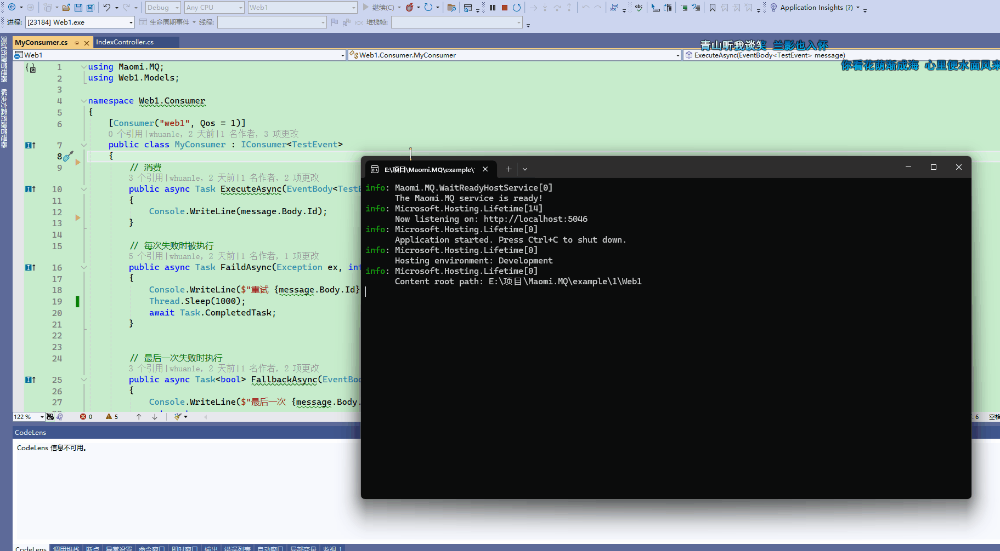

# 消费者模式

消费者模式只需要实现 `IConsumer<TEvent>` 接口，并添加特性即可。

```
public class TestEvent
{
	public int Id { get; set; }

	public override string ToString()
	{
		return Id.ToString();
	}
}
```


```csharp
    [Consumer("web1", Qos = 1)]
    public class MyConsumer : IConsumer<TestEvent>
    {
        // 消费
        public async Task ExecuteAsync(EventBody<TestEvent> message)
        {
            Console.WriteLine(message.Body.Id);
        }

        // 每次失败时被执行
        public async Task FaildAsync(Exception ex, int retryCount, EventBody<TestEvent>? message)
        {
            Console.WriteLine($"重试 {message.Body.Id}");
            Thread.Sleep(1000);
            await Task.CompletedTask;
        }

        // 最后一次失败时执行
        public async Task<bool> FallbackAsync(EventBody<TestEvent>? message)
        {
            Console.WriteLine($"最后一次 {message.Body.Id}");
            return true;
        }
    }
```




当收到服务器推送的消息时，`ExecuteAsync` 方法会被自动执行，其它两个方法可以参考重试。

当 ExecuteAsync 方法执行异常时，框架会自动重试，默认会重试五次，如果五次都失败，则会执行 FallbackAsync 方法进行补偿。


如果重试五次失败，但是调用 FallbackAsync 返回 true 时，框架会认为该条消息被正确处理，然后该条消息会被框架 ACK。

如果重试多次依然失败，FallbackAsync 方法会被用于补偿，如果 FallbackAsync 返回 true 或出现异常，则补偿失败，该条消息会被标记为失败，可以重新放回队列或丢弃。当特性中设置 `RetryFaildRequeue = true` 后，重试和补偿失败后，该消息会被放回队列中。

```
[Consumer("web1", Qos = 1 , RetryFaildRequeue = true)]
```


让程序需要严格根据顺序消费时，可以使用 `Qos = 1`，框架会严格保证逐条消费，如果程序不需要顺序消费，希望可以快速处理所有消息，则可以将 Qos 设置大一些。

同时，由于 Qos 和重试、补偿机制会有多种情况，因此请参考重试。


讲解 Consumer 特性。