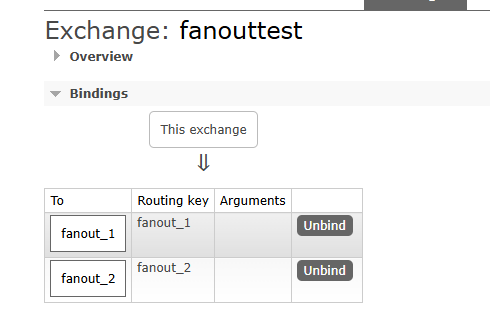
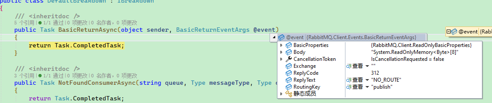
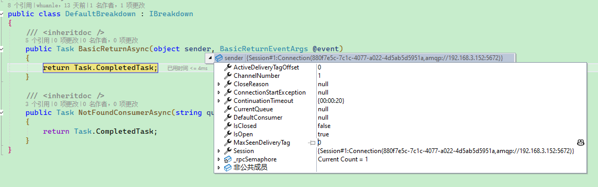

# 消息发布者

消息发布者用于推送消息到 RabbitMQ 服务器中，Maomi.MQ 支持多种消息发布者模式，支持 RabbitMQ 事务模式等，示例项目请参考 [PublisherWeb](https://github.com/whuanle/Maomi.MQ/example/publisher/PublisherWeb)。

Maomi.MQ 通过 IMessagePublisher 向开发者提供消息推送服务。


在发布消息之前，需要定义一个事件模型类，用于传递消息。

```csharp
public class TestEvent
{
	public int Id { get; set; }

	public override string ToString()
	{
		return Id.ToString();
	}
}
```


然后注入 IMessagePublisher 服务，发布消息：

```csharp
[ApiController]
[Route("[controller]")]
public class IndexController : ControllerBase
{
	private readonly IMessagePublisher _messagePublisher;

	public IndexController(IMessagePublisher messagePublisher)
	{
		_messagePublisher = messagePublisher;
	}

    [HttpGet("publish")]
    public async Task<string> Publisher()
    {
        for (var i = 0; i < 100; i++)
        {
            await _messagePublisher.PublishAsync(exchange: string.Empty, routingKey: "publish", message: new TestEvent
            {
                Id = i
            });
        }

        return "ok";
    }
}
```


一般情况下，一个模型类只会被一个消费者所使用，那么通过事件可以找到唯一的消费者，也就是通过事件类型找到消费者的 IConsumerOptions，此时框架可以使用对应的配置发送消息。

TestMessageEvent 模型只有一个消费者：

```csharp
[Consumer("publish", Qos = 1, RetryFaildRequeue = true)]
public class TestEventConsumer : IConsumer<TestMessageEvent>
{
	// ... ...
}
```


可以直接发送事件，不需要填写交换器(Exchange)和路由键(RoutingKey)。

```csharp
[HttpGet("publish_message")]
public async Task<string> PublisherMessage()
{
	// 如果在本项目中 TestMessageEvent 只指定了一个消费者，那么通过 TestMessageEvent 自动寻找对应的配置
	for (var i = 0; i < 100; i++)
	{
		await _messagePublisher.PublishAsync(model: new TestMessageEvent
		{
			Id = i
		});
	}

	return "ok";
}
```


### IMessagePublisher

IMessagePublisher 是 Maomi.MQ 的基础消息发布接口，有以下方法：

```csharp
// 消息发布者.
public interface IMessagePublisher
{
    Task PublishAsync<TMessage>(string exchange,    // 交换器名称.
                                string routingKey,  // 队列/路由键名称.
                                TMessage message,   // 事件对象.
                                Action<BasicProperties> properties, 
                                CancellationToken cancellationToken = default)
        where TMessage : class;

    Task PublishAsync<TMessage>(string exchange, 
                                string routingKey, 
                                TMessage message, 
                                BasicProperties? properties = default, 
                                CancellationToken cancellationToken = default);

    Task PublishAsync<TMessage>(TMessage message, 
                                Action<BasicProperties>? properties = null, 
                                CancellationToken cancellationToken = default)
        where TMessage : class;

    Task PublishAsync<TMessage>(TMessage model, 
                                BasicProperties? properties = default, 
                                CancellationToken cancellationToken = default);
    
    Task CustomPublishAsync<TMessage>(string exchange, 
                                      string routingKey, 
                                      TMessage message, 
                                      BasicProperties? properties = default, 
                                      CancellationToken cancellationToken = default);
}
```


Maomi.MQ 的消息发布接口就这么几个，由于直接公开了 BasicProperties ，因此开发者完全自由配置 RabbitMQ 原生的消息属性，所以接口比较简单，开发者使用接口时可以灵活一些，使用难度也不大。


BasicProperties 是 RabbitMQ 中的消息基础属性对象，直接面向开发者，可以消息的发布和消费变得灵活和丰富功能，例如，可以通过 BasicProperties 配置单条消息的过期时间：

```csharp
await _messagePublisher.PublishAsync(exchange: string.Empty, routingKey: "publish", message: new TestEvent
{
	Id = i
}, (BasicProperties p) =>
{
	p.Expiration = "1000";
});
```


Maomi.MQ 通过 DefaultMessagePublisher 类型实现了 IMessagePublisher，DefaultMessagePublisher 默认生命周期是 Scoped：

```csharp
services.AddScoped<IMessagePublisher, DefaultMessagePublisher>();
```


开发者也可以自行实现 IMessagePublisher 接口，实现自己的消息发布模型，具体示例请参考 DefaultMessagePublisher 类型。


### 原生通道

开发者可以通过 `ConnectionPool` 服务获取原生连接对象，直接在 IConnection 上使用 RabbitMQ 的接口发布消息：

```csharp
private readonly ConnectionPool _connectionPool;

var connectionObject = _connectionPool.Get();
connectionObject.DefaultChannel.BasicPublishAsync(... ...);
```


### 常驻内存连接对象

Maomi.MQ 通过 ConnectionPool 管理 RabbitMQ 连接对象，注入 ConnectionPool 服务后，通过 `.Get()` 接口获取全局默认连接实例。


如果开发者有自己的需求，也可以通过 `.Create()` 接口创建新的连接对象。

```csharp
using var newConnectionObject = _connectionPool.Create();
using var newConnection = newConnectionObject.Connection;
using var newChannel = newConnection.CreateChannelAsync();
```

> 请务必妥善使用连接对象，不要频繁创建和释放，也不要忘记了管理生命周期，否则容易导致内存泄漏。


单个 IConnectionn 即可满足大多数场景下的使用，吞吐量足够用了，笔者经过了多次长时间的测试，发现一个 IConnection 即可满足需求，多个 IConnection 并不会带来任何优势，因此去掉了旧版本的连接池，现在默认全局只会存在一个 IConnection，但是不同的消费者使用 IChannel 来隔离。

程序只维持一个 IConnection 时，四个发布者同时发布消息，每秒速度如下：


如果消息内容非常大时，单个 IConnection 也足够应付，取决于带宽。

> 每条消息 478 KiB。


### 消息过期

IMessagePublisher 对外开放了 BasicProperties，开发者可以自由配置消息属性。

例如为消息配置过期时间：

```csharp
[HttpGet("publish")]
public async Task<string> Publisher()
{
	for (var i = 0; i < 1; i++)
	{
		await _messagePublisher.PublishAsync(exchange: string.Empty, routingKey: "publish", message: new TestEvent
		{
			Id = i
		}, properties =>
		{
			properties.Expiration = "6000";
		});
	}

	return "ok";
}
```


为该消息设置过期时间后，如果队列绑定了死信队列，那么该消息长时间没有被消费时，会被移动到另一个队列，请参考 [死信队列](6.dead_queue.md)。


还可以通过配置消息属性实现更多的功能，请参考 [IBasicProperties](https://rabbitmq.github.io/rabbitmq-dotnet-client/api/RabbitMQ.Client.IBasicProperties.html) 文档。


### 事务

RabbitMQ 原生支持事务模型，RabbitMQ 的事务通讯协议可以参考 https://www.rabbitmq.com/docs/semantics

据 RabbitMQ 官方文档显示，事务模式会使吞吐量减少 250 倍，这个主要跟事务机制有关，事务模式不仅仅要保证消息已经推送到 Rabbit broker，还要保证 Rabbit broker 多节点分区同步，在 Rabbit broker 挂掉的情况下消息已被完整同步。不过一般可能用不上这么严格的模式，所以也可以使用下一小节提到的发送方确认机制。


Maomi.MQ 的事务接口使用上比较简单，可以使用扩展方法直接开启一个 ITransactionPublisher，事务接口使用上也比较简洁，示例如下：

```csharp
[HttpGet("publish_tran")]
public async Task<string> Publisher_Tran()
{
	using var tranPublisher = _messagePublisher.CreateTransaction();
	await tranPublisher.TxSelectAsync();

	try
	{
		await tranPublisher.PublishAsync(exchange: string.Empty, routingKey: "publish", message: new TestEvent
		{
			Id = 666
		});
		await Task.Delay(5000);
		await tranPublisher.TxCommitAsync();
	}
	catch
	{
		await tranPublisher.TxRollbackAsync();
		throw;
	}

	return "ok";
}
```


### 发送方确认模式

事务模式可以保证消息会被推送到 RabbitMQ 服务器中，并在个节点中已完成同步，但是由于事务模式会导致吞吐量降低 250 倍，因此  RabbitMQ 引入了一种确认机制，这种机制就像滑动窗口，能够保证消息推送到服务器中，并且具备高性能的特性，其吞吐量是事务模式 100 倍，参考资料：

https://www.rabbitmq.com/blog/2011/02/10/introducing-publisher-confirms

https://www.rabbitmq.com/docs/confirms


不过 .NET RabbitMQClient 库的新版本已经去掉了一些 API 接口，改动信息详细参考：[Issue #1682](https://github.com/rabbitmq/rabbitmq-dotnet-client/issues/1682) 、[RabbitMQ tutorial - Reliable Publishing with Publisher Confirms](https://www.rabbitmq.com/tutorials/tutorial-seven-dotnet)


Maomi.MQ 根据新版本做了简化调整，具体用法是通过创建使用独立通道的消息发布者，然后在参数中指定 IChannel 属性。

```csharp
using var confirmPublisher = _messagePublisher.CreateSingle(
	new CreateChannelOptions(publisherConfirmationsEnabled: true, publisherConfirmationTrackingEnabled: true));

for (var i = 0; i < 5; i++)
{
	await confirmPublisher.PublishAsync(exchange: string.Empty, routingKey: "publish", message: new TestEvent
	{
		Id = 666
	});
}
```


事务模式和确认机制模式发布者是相互隔离的，创建这两者对象时都会默认自动使用新的 IChannel，因此不需要担心冲突。


如果开发者有自己的需求，也可以 CreateSingle 创建独立的 IChannel，然后自定义 CreateChannelOptions 属性，关于 CreateChannelOptions 的描述，请参考：

https://rabbitmq.github.io/rabbitmq-dotnet-client/api/RabbitMQ.Client.CreateChannelOptions.html


### 广播模式

广播模式是用于将一条消息推送到交换器，然后绑定的多个队列都可以收到相同的消息，简单来说该模式是向交换器推送消息，然后交换器将消息转发到各个绑定的队列中，这样一来不同队列的消费者可以同时收到消息。


RabbitMQ 中，交换器大约有四种模式，在 RabbitMQ 中有常量定义：

```csharp
public static class ExchangeType
{
	public const string Direct = "direct";
	public const string Fanout = "fanout";
	public const string Headers = "headers";
	public const string Topic = "topic";
	private static readonly string[] s_all = { Fanout, Direct, Topic, Headers };
}
```


但是不同的交换器模式使用上不一样，下面笔者 fanout 为例，当队列绑定到 fanout 类型的交换器后，Rabbit broker 会忽略 RoutingKey，将消息推送到所有绑定的队列中。

所以我们定义两个消费者，绑定到一个相同的 fanout 类型的交换器：

```csharp
[Consumer("fanout_1", BindExchange = "fanouttest", ExchangeType = "fanout")]
public class FanoutEvent_1_Consumer : IConsumer<FanoutEvent>
{
    // 消费
    public virtual async Task ExecuteAsync(MessageHeader messageHeader, FanoutEvent message)
    {
        Console.WriteLine($"【fanout_1】，事件 id: {message.Id} {DateTime.Now}");
        await Task.CompletedTask;
    }
    
    // ... ...
}

[Consumer("fanout_2", BindExchange = "fanouttest", ExchangeType = "fanout")]
public class FanoutEvent_2_Consumer : IConsumer<FanoutEvent>
{
    // 消费
    public virtual async Task ExecuteAsync(MessageHeader messageHeader, FanoutEvent message)
    {
        Console.WriteLine($"【fanout_2】，事件 id: {message.Id} {DateTime.Now}");
        await Task.CompletedTask;
    }
    
    // ... ...
}
```



发布消息时，只需要配置交换器名称即可，两个消费者服务都会同时收到消息：

```csharp
[HttpGet("publish_fanout")]
public async Task<string> Publisher_Fanout()
{
	for (var i = 0; i < 5; i++)
	{
		await _messagePublisher.PublishAsync(exchange: "fanouttest", routingKey: string.Empty, message: new FanoutEvent
		{
			Id = 666
		});
	}

	return "ok";
}
```


对于 Topic 类型的交换器和队列，使用方式也是一致的，定义两个消费者：

```csharp
[Consumer("red.yellow.#", BindExchange = "topictest", ExchangeType = "topic")]
public class TopicEvent_1_Consumer : IConsumer<TopicEvent>
{
    // 消费
    public virtual async Task ExecuteAsync(MessageHeader messageHeader, TopicEvent message)
    {
        Console.WriteLine($"【red.yellow.#】，事件 id: {message.Id} {DateTime.Now}");
        await Task.CompletedTask;
    }
    
    // ... ...
}

[Consumer("red.#", BindExchange = "topictest", ExchangeType = "topic")]
public class TopicEvent_2_Consumer : IConsumer<TopicEvent>
{
    // 消费
    public virtual async Task ExecuteAsync(MessageHeader messageHeader, TopicEvent message)
    {
        Console.WriteLine($"【red.#】，事件 id: {message.Id} {DateTime.Now}");
        await Task.CompletedTask;
    }
    
    // ... ...
}
```


发布消息：

```csharp
[HttpGet("publish_topic")]
public async Task<string> Publisher_Topic()
{
	for (var i = 0; i < 5; i++)
	{
		await _messagePublisher.PublishAsync(exchange: "topictest", routingKey: "red.a", message: new TopicEvent
		{
			Id = 666
		});
		await _messagePublisher.PublishAsync(exchange: "topictest", routingKey: "red.yellow.a", message: new TopicEvent
		{
			Id = 666
		});
	}

	return "ok";
}
```


### 不可路由消息

当发布消息时，如果该消息不可路由，即找不对应的队列等情况，那么将会触发 `IBreakdown.BasicReturnAsync` 接口，`BasicReturnEventArgs` 属性有详细的错误原因。







对于网络故障、RabbitMQ 服务挂了、没有对应交换器名称等失败等情况，则会在当前线程上出现异常，并且 TCP 连接会自动重新连接。

需要注意 RabbitMQ 的机制，推送消息并不是同步发生的，因此即使推送失败，也不会在当前线程中出现异常，所以不能判断当前消息是否成功推送。

对于不可路由的消息，Maomi.MQ 只提供了简单的接口通知，没有其它处理机制，所以开发者需要自行处理，社区中有一款 MQ 通讯框架叫 EasyNetQ，它的默认机制是自动创建新的队列，将当前不可路由的队列推送到新的队列中，以便持久化保存。


开发者可以实现该接口，然后注册为到容器：

```csharp
services.AddScoped<IBreakdown, MyDefaultBreakdown>();
```


例如将不可路由的消息推送到新的队列中：

```csharp
public class MyDefaultBreakdown : IBreakdown
{
    private readonly ConnectionPool _connectionPool;

    public MyDefaultBreakdown(ConnectionPool connectionPool)
    {
        _connectionPool = connectionPool;
    }

    /// <inheritdoc />
    public async Task BasicReturnAsync(object sender, BasicReturnEventArgs @event)
    {
        var connectionObject = _connectionPool.Get();
        await connectionObject.DefaultChannel.BasicPublishAsync<BasicProperties>(
            @event.Exchange, 
            @event.RoutingKey + ".faild", 
            true, 
            new BasicProperties(@event.BasicProperties), 
            @event.Body);
    }

    /// <inheritdoc />
    public Task NotFoundConsumerAsync(string queue, Type messageType, Type consumerType)
    {
        return Task.CompletedTask;
    }
}
```


其实对于这种不可路由消息的情况，不单单只是转发存储，要检查是否误删队列、发布消息时队列名称是否一致等。
