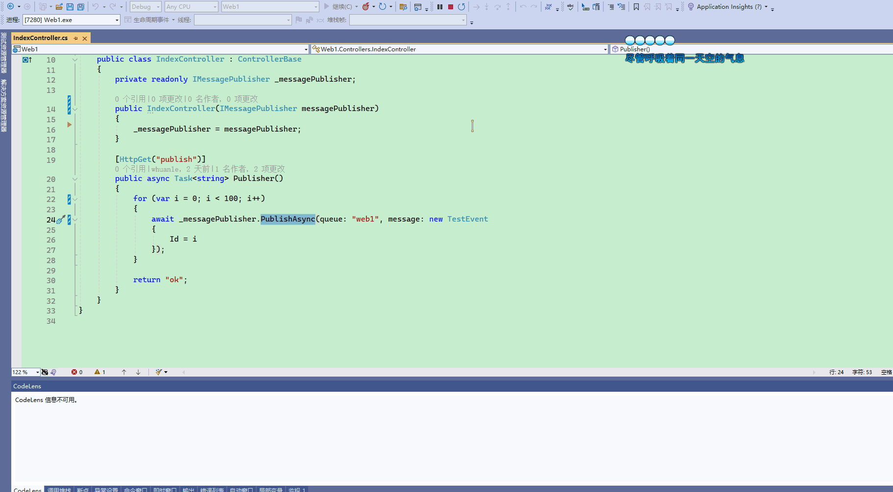

# 消息发布者

请参考示例 `examples/1/Web1`。

定义一个事件模型类：

```csharp
public class TestEvent
{
	public int Id { get; set; }

	public override string ToString()
	{
		return Id.ToString();
	}
}
```


注入 IMessagePublisher ：

```csharp
    [ApiController]
    [Route("[controller]")]
    public class IndexController : ControllerBase
    {
        private readonly IMessagePublisher _messagePublisher;

        public IndexController(IMessagePublisher messagePublisher)
        {
            _messagePublisher = messagePublisher;
        }

        [HttpGet("publish")]
        public async Task<string> Publisher()
        {
            for (var i = 0; i < 100; i++)
            {
                await _messagePublisher.PublishAsync(queue: "web1", message: new TestEvent
                {
                    Id = i
                });
            }

            return "ok";
        }
    }
```





IMessagePublisher 定义比较简单，只有三个方法和一个属性：

```csharp
public ConnectionPool ConnectionPool { get; }

Task PublishAsync<TEvent>(string queue, TEvent message, Action<IBasicProperties>? properties = null)
where TEvent : class;

Task PublishAsync<TEvent>(string queue, TEvent message, BasicProperties properties);

Task PublishAsync<TEvent>(string queue, EventBody<TEvent> message, BasicProperties properties);
```


DefaultMessagePublisher 是 IMessagePublisher 的默认实现，内部还有一个连接池。

刚开始 DefaultMessagePublisher 不会创建 RabbitMQ.Client.IConnection，只有使用时才会创建 ，并且默认最大连接数量为 `Environment.ProcessorCount * 2`。


如果你觉得 IMessagePublisher  接口提供的 PublishAsync 方法不好用，可以自行从 ConnectionPool 获取连接对象。

```csharp
private readonly ConnectionPool _connectionPool;

public DefaultMessagePublisher(ConnectionPool connectionPool)
{
	_connectionPool = connectionPool;
}

public async Task MyPublshAsync()
{

	var connection = _connectionPool.Get();
	try
	{
		await connection.Channel.BasicPublishAsync(...);

	}
	finally
	{
		_connectionPool.Return(connection);
	}
}
```


使用 ConnectionPool 获取 IConnection 后，请一定要使用 `ConnectionPool.Return()` 方法将其归还对象池。