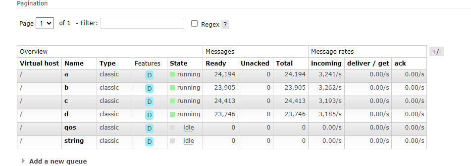
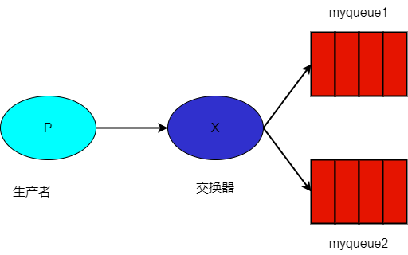

# 消息发布者

消息发布者用于推送消息到 RabbitMQ 服务器中。

通过注入 IMessagePublisher 接口即可向 RabbitMQ 推送消息，示例项目请参考 [PublisherWeb](https://github.com/whuanle/Maomi.MQ/example/publisher/PublisherWeb)。


定义一个事件模型类：

```csharp
public class TestEvent
{
	public int Id { get; set; }

	public override string ToString()
	{
		return Id.ToString();
	}
}
```


注入 IMessagePublisher 服务后发布消息：

```csharp
[ApiController]
[Route("[controller]")]
public class IndexController : ControllerBase
{
	private readonly IMessagePublisher _messagePublisher;

	public IndexController(IMessagePublisher messagePublisher)
	{
		_messagePublisher = messagePublisher;
	}

	[HttpGet("publish")]
	public async Task<string> Publisher()
	{
		for (var i = 0; i < 100; i++)
		{
			await _messagePublisher.PublishAsync(queue: "PublisherWeb", message: new TestEvent
			{
				Id = i
			});
		}

		return "ok";
	}
}
```


### IMessagePublisher

IMessagePublisher 定义比较简单，只有三个方法：

```csharp
Task PublishAsync<TEvent>(string queue, TEvent message, Action<IBasicProperties>? properties = null)
where TEvent : class;

Task PublishAsync<TEvent>(string queue, TEvent message, IBasicProperties properties);

//  不建议直接使用该接口。
Task CustomPublishAsync<TEvent>(string queue, EventBody<TEvent> message, BasicProperties properties);
```


三个 PublishAsync 方法用于发布事件。


由于直接公开了 BasicProperties ，因此开发者完全自由配置 RabbitMQ 原生的消息属性，所以 Maomi.MQ.RabbitMQ 只提供了简单的功能接口。


例如，可以通过 BasicProperties 配置单条消息的过期时间：

```csharp
await _messagePublisher.PublishAsync(queue: "RetryWeb", message: new TestEvent
{
	Id = i
}, (BasicProperties p) =>
{
	p.Expiration = "1000";
});
```


当发布一条消息时，实际上框架传递的是 `EventBody<T>` 类型，`EventBody<T>` 中包含了一些重要的附加消息属性，这些属性会给消息处理和故障诊断带来很大的方便。

```csharp
public class EventBody<TEvent>
{
	// 事件唯一 id.
	public long Id { get; init; }

	// Queue.
	public string Queue { get; init; } = null!;

	// App name.
	public string Publisher { get; init; } = null!;

	// 事件创建时间.
	public DateTimeOffset CreationTime { get; init; }

	// 事件体.
	public TEvent Body { get; init; } = default!;
}
```


Maomi.MQ 通过 DefaultMessagePublisher 类型实现了 IMessagePublisher，DefaultMessagePublisher 默认生命周期是 Singleton：

```csharp
services.AddSingleton<IMessagePublisher, DefaultMessagePublisher>();
```


生命周期不重要，如果需要修改默认的生命周期，可以手动修改替换。

```
services.AddScoped<IMessagePublisher, DefaultMessagePublisher>();
```


开发者也可以自行实现 IMessagePublisher 接口，具体示例请参考 DefaultMessagePublisher 类型。


### 常驻内存连接对象

新版本已经去掉了[连接池](#连接池(新版本已去掉))，全局使用一个 IConnection。

一开始主要考虑逻辑隔离，但是代码逐渐完善之后，发现代码只需要简单的实现即可隔离。同时，经过了多次长时间的测试，发现一个 IConnection 即可满足需求，多个 IConnection 并不会带来任何优势，因此去掉了连接池，一个程序内只会存在一个 IConnection。


单个 IConnectionn 即可满足大多数场景下的使用，吞吐量足够用了。

程序只维持一个 IConnection 时，四个发布者同时发布消息，每秒速度如下：




如果消息内容非常大时，单个 IConnection 也足够应付，取决于带宽。

> 每条消息 478 KiB。


### 消息过期

IMessagePublisher 对外开放了 BasicProperties 或 BasicProperties，可以自由配置消息属性。

例如为消息配置过期时间：

```csharp
[HttpGet("publish")]
public async Task<string> Publisher()
{
	for (var i = 0; i < 1; i++)
	{
		await _messagePublisher.PublishAsync(queue: "test", message: new TestEvent
		{
			Id = i
		}, properties =>
		{
			properties.Expiration = "6000";
		});
	}

	return "ok";
}
```


如果此时为 `test` 绑定死信队列，那么该消息长时间没有被消费时，会被移动到另一个队列，请参考 [死信队列](6.dead_queue.md)。


还可以通过配置消息属性实现更多的功能，请参考 [IBasicProperties](https://rabbitmq.github.io/rabbitmq-dotnet-client/api/RabbitMQ.Client.IBasicProperties.html)。


### 事务

RabbitMQ 支持事务，不过据 RabbitMQ 官方文档显示，事务会使吞吐量减少 250 倍。

RabbitMQ 事务使用上比较简单，可以保证发布的消息已经被推送到 RabbitMQ 服务器，只有当提交事务时，提交的消息才会被 RabbitMQ 存储并推送给消费者。

使用示例：

```csharp
[HttpGet("publish_tran")]
public async Task<string> Publisher_Tran()
{
	using var tranPublisher = await _messagePublisher.TxSelectAsync();

	try
	{
		await tranPublisher.PublishAsync(queue: "publish_tran", message: new TestEvent
		{
			Id = 666
		});
		await tranPublisher.TxCommitAsync();
	}
	catch
	{
		await tranPublisher.TxRollbackAsync();
		throw;
	}

	return "ok";
}
```


或者手动开启事务：

```csharp
[HttpGet("publish_tran")]
public async Task<string> Publisher_Tran()
{
	using var tranPublisher = _messagePublisher.CreateTransaction();

	try
	{
		await tranPublisher.TxSelectAsync();
		await tranPublisher.PublishAsync(queue: "publish_tran", message: new TestEvent
		{
			Id = 666
		});
		await tranPublisher.TxCommitAsync();
	}
	catch
	{
		await tranPublisher.TxRollbackAsync();
		throw;
	}

	return "ok";
}
```


### 发送方确认模式

虽然事务模式可以保证消息会被推送到 RabbitMQ 服务器中，但是由于事务模式会导致吞吐量降低 250 倍，因此不是一个好的选择。为了解决这个问题， RabbitMQ 引入了一种确认机制，这种机制就像滑动窗口，能够保证消息推送到服务器中，并且具备高性能的特性。

> 请参考 https://www.rabbitmq.com/docs/confirms


使用示例：

```csharp
[HttpGet("publish_confirm")]
public async Task<string> Publisher_Confirm()
{
	using var confirmPublisher = await _messagePublisher.ConfirmSelectAsync();

	for (var i = 0; i < 5; i++)
	{
		await confirmPublisher.PublishAsync(queue: "publish_confirm1", message: new TestEvent
		{
			Id = 666
		});

		var result = await confirmPublisher.WaitForConfirmsAsync();

		// 如果在超时内没有接收到 nacks，则为 True，否则为 false。
		Console.WriteLine($"发布 {i},{result}");
	}

	return "ok";
}
```


`WaitForConfirmsAsync` 方法会返回一个值，如果正常被服务器确认了消息已经传达，则结果为 true，如果超时没有被服务器确认，则返回 false。


此外，还有一个 `WaitForConfirmsOrDieAsync` 方法，它会一直等待该频道上的所有已发布消息都得到确认，使用示例：

```csharp
using var confirmPublisher = await _messagePublisher.ConfirmSelectAsync();

for (var i = 0; i < 5; i++)
{
	await confirmPublisher.PublishAsync(queue: "publish_confirm1", message: new TestEvent
	{
		Id = 666
	});

	Console.WriteLine($"发布 {i}");
}

await confirmPublisher.WaitForConfirmsOrDieAsync();
```


事务模式和确认机制模式发布者是相互隔离的，因此可以很安全地同时创建这两者的对象。

```csharp
using var confirmPublisher = await _messagePublisher.ConfirmSelectAsync();
using var tranPublisher = await _messagePublisher.TxSelectAsync();
```


两个发布者之间是相互独立的。


### 广播模式

广播模式是用于将一条消息推送到交换器，然后绑定的多个队列都可以收到相同的消息。如果你对 RabbitMQ 不了解，也没关系，简单来说该模式是向交换器推送消息，然后交换器将消息转发到各个绑定的队列中，这样一来不同队列的消费者可以同时收到消息。



创建交换器发布者：

```csharp
        using var exchange = _messagePublisher.CreateExchange();
        for (var i = 0; i < 1; i++)
        {
            // 这里的队列名称其实是交换机名称
            await exchange.PublishAsync(queue: "aaa", message: new TestEvent
            {
                Id = i
            });
        }

        return "ok";
```


当然，广播模式发布者也可以有事务、发送方确认模式、独占模式。

```csharp
        var exchange = _messagePublisher.CreateExchange();
        using var single = exchange.CreateSingle();
        for (var i = 0; i < 1; i++)
        {
            await single.PublishAsync(queue: "aaa", message: new TestEvent
            {
                Id = i
            });
        }
```


消费者需要绑定对应的交换器才能收到消息，请参考 [广播模式](2.1.consumer.md#广播模式)
