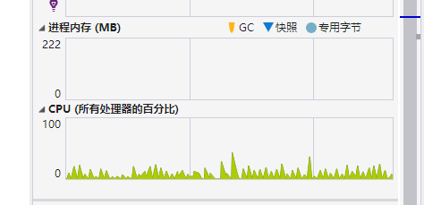

# Qos 并发和顺序

基于消费者模式和基于事件模式都是通过特性来配置消费属性，Qos 是其中一个重要的属性，Qos 默认值为 100，Qos 配置指的是一次允许消费者接收多少条未确认的消息。


### Qos 场景

全局所有消费者共用一个 IConnection 对象，每个消费者独占一个 IChannel。


对于消费频率很高但是不能并发的队列，请务必设置 `Qos = 1`，这样 RabbitMQ 会逐个推送消息，在保证顺序的情况下，保证消费严格顺序。

```csharp
[Consumer("web1", Qos = 1)]
public class MyConsumer : IConsumer<TestEvent>
{
}
```


当需要需要提高消费吞吐量，而且不需要顺序消费时，可以将 Qos 设置高一些，RabbitMQ Client 框架会通过预取等方式提高吞吐量，并且多条消息可以并发消费。


### 并发和异常处理

主要根据 Qos 和 RetryFaildRequeue 来处理，RetryFaildRequeue 默认是 true。

在 `Qos = 1` 的情况下，结合 `IConsumerOptions.RetryFaildRequeue` 和  `FallbackAsync` ，当该消息放回队列时，下一次还是继续消费该条消息。

在 `Qos > 1` 的情况下，由于并发性，那么消费失败的消息会被放回队列中，但是不一定下一次会立即重新消费该条消息。

Qos 为 1 时，会保证严格顺序消费，ExecptionRequeue 、RetryFaildRequeue 会影响失败的消息是否会被放回队列，如果放回队列，下一次消费会继续消费之前失败的消息。如果错误（如 bug）得不到解决，则会出现消费、失败、放回队列、重新消费这样的循环。


### 如何设置 Qos 

注意，在 RabbitMQClient 7.0 版本中，新增了很多东西，其中一个是消费者并发线程数 ConsumerDispatchConcurrency ，默认为 1，如果不修改该配置，会导致消费速度非常低下，每个 IChannel 都可以单独设置该属性，也可以在 ConnectionFactory 设置默认全局属性。

```csharp
services.AddMaomiMQ(options =>
{
	options.WorkId = 1;
	options.AppName = "myapp-consumer";
	options.Rabbit = (options) =>
	{
		options.HostName = Environment.GetEnvironmentVariable("RABBITMQ")!;
		options.Port = 5672;
		options.ClientProvidedName = Assembly.GetExecutingAssembly().GetName().Name;
		options.ConsumerDispatchConcurrency = 100;		// 设置这里
	};
}, new System.Reflection.Assembly[] { typeof(Program).Assembly });

```


Maomi.MQ.RabbitMQ 中的 Qos 指 prefetch_count，取值范围是 0-65535，为 0 时指不限制，一般默认设置为 100 即可，Qos 设置再大不一定可以提高消费效率。

Qos 不等于消费者并发线程数量，而是指一次可以接收的未经处理的消息数量，消费者可以一次性拉取 N 条，然后逐个消费。


根据官方 [Finding bottlenecks with RabbitMQ 3.3 | RabbitMQ](https://www.rabbitmq.com/blog/2014/04/14/finding-bottlenecks-with-rabbitmq-3-3) 文档显示，预取数量对象会影响消费者的队列利用率。

| Prefetch limit预取限制 | Consumer utilisation消费者使用率 |
| ---------------------- | -------------------------------- |
| 1                      | 14%                              |
| 3                      | 25%                              |
| 10                     | 46%                              |
| 30                     | 70%                              |
| 1000                   | 74%                              |


一般情况下需要开发者中综合各类因素去配置 Qos，应当综合考虑机器网络带宽、每条消息的大小、发布消息的频率、估算程序整体占用的资源、服务实例等情况。

当程序需要严格顺序消费时，可以设置为 1。

如果在内网连接 RabbitMQ 可以无视网络带宽限制，消息的内容十分大、需要极高的并发量时，可以设置 Qos = 0。当 Qos = 0 时，RabbitMQ.Client 会尽可能吃掉机器的性能，请谨慎使用。


### Qos 和消费性能测试

为了说明不同 Qos 对消费者程序的性能影响，下面设置不同 Qos 消费 100w 条消息的代码进行测试，在启动消费者之前， 先向 RabbitMQ 服务器推送 100w 条数据。

定义事件：

```csharp
public class TestEvent
{
    public int Id { get; set; }
    public string Message { get; set; }
    public int[] Data { get; set; }

    public override string ToString()
    {
        return Id.ToString();
    }
}
```


QosPublisher 项目的消息发布者代码如下，用于向服务器推送 100w 条消息，每条的消息内容约 800 byte，小于 1k。

```csharp
[HttpGet("publish")]
public async Task<string> Publisher()
{
	int totalCount = 0;
	List<Task> tasks = new();
	var message = string.Join(",", Enumerable.Range(0, 100));
	var data = Enumerable.Range(0, 100).ToArray();
	for (var i = 0; i < 100; i++)
	{
		var task = Task.Factory.StartNew(async () =>
		{
			using var singlePublisher = _messagePublisher.CreateSingle();

			for (int k = 0; k < 10000; k++)
			{
				var count = Interlocked.Increment(ref totalCount);
				await singlePublisher.PublishAsync(exchange: string.Empty, routingKey: "qos", message: new TestEvent
				{
					Id = count,
					Message = message,
					Data = data
				});
			}
		});
		tasks.Add(task);
	}

	await Task.WhenAll(tasks);
	return "ok";
}
```


等待一段时间后，服务器已经有 100w 条消息了。


创建消费者项目 QosConsole，人为给消费者增加 50ms 的耗时，运行程序。

```csharp
class Program
{
    static async Task Main()
    {
        var host = new HostBuilder()
            .ConfigureLogging(options =>
            {
                options.AddConsole();
                options.AddDebug();
            })
            .ConfigureServices(services =>
            {
                services.AddMaomiMQ(options =>
                {
                    options.WorkId = 1;
                    options.AppName = "myapp-consumer";
                    options.Rabbit = (options) =>
                    {
                        options.HostName = Environment.GetEnvironmentVariable("RABBITMQ")!;
                        options.Port = 5672;
                        options.ClientProvidedName = Assembly.GetExecutingAssembly().GetName().Name;
                        options.ConsumerDispatchConcurrency = 1000;
                    };
                }, new System.Reflection.Assembly[] { typeof(Program).Assembly });

            }).Build();

        Console.WriteLine($"start time:{DateTime.Now}");
        await host.RunAsync();
    }
}


[Consumer("qos", Qos = 30)]
public class QosConsumer : IConsumer<TestEvent>
{
    private static int Count = 0;

    public async Task ExecuteAsync(MessageHeader messageHeader, TestEvent message)
    {
        Interlocked.Increment(ref Count);
        Console.WriteLine($"date time:{DateTime.Now},id:{message.Id}, count:{Count}");
        await Task.Delay(50);
    }

    public Task FaildAsync(MessageHeader messageHeader, Exception ex, int retryCount, TestEvent message)
    {
        return Task.CompletedTask;
    }

    public Task<ConsumerState> FallbackAsync(MessageHeader messageHeader, TestEvent? message, Exception? ex)
    {
        return Task.FromResult(ConsumerState.Ack);
    }
}
```


为了有直观的对比，这里也直接使用 RabbitMQ.Client 编写原生消费者项目 RabbitMQConsole。

```csharp
static async Task Main()
{
	ConnectionFactory connectionFactory = new ConnectionFactory
	{
		HostName = Environment.GetEnvironmentVariable("RABBITMQ")!,
		Port = 5672,
		ConsumerDispatchConcurrency = 1000
	};

	var connection = await connectionFactory.CreateConnectionAsync();
	var channel = await connection.CreateChannelAsync(new CreateChannelOptions(
		publisherConfirmationsEnabled: false,
		publisherConfirmationTrackingEnabled: false,
		consumerDispatchConcurrency: 1000));
	var messageSerializer = new DefaultMessageSerializer();

	var consumer = new AsyncEventingBasicConsumer(channel);
	await channel.BasicQosAsync(prefetchSize: 0, prefetchCount: 1000, global: true);

	consumer.ReceivedAsync += async (sender, eventArgs) =>
	{
		var testEvent = messageSerializer.Deserialize<TestEvent>(eventArgs.Body.Span);
		Console.WriteLine($"start time:{DateTime.Now} {testEvent.Id}");
		await Task.Delay(50);
		await channel.BasicAckAsync(eventArgs.DeliveryTag, false);
	};

	await channel.BasicConsumeAsync(
		queue: "qos",
		autoAck: false,
		consumer: consumer);

	while (true)
	{
		await Task.Delay(10000);
	}
}
```


Maomi.MQ.RabbitMQ 是基于 RabbitMQ.Client 进行封装的，Maomi.MQ.RabbitMQ 消费时需要记录日志、增加可观测性信息、构建新的依赖注入容器 等，因此耗时和资源消耗肯定会比 RabbitMQ.Client 多一些，因此需要将两者对比一下。


以 Release 模式在 VS 中启动程序，以单进程方式，分开启动 QosConsole、RabbitMQConsole 进行测试，并测试不同 Qos 情况下的消费速度。


下面来看不同 Qos 值对应的消费速度(ack)。

| Qos  | RabbitMQ.Client | Maomi.MQ.RabbitMQ |
| ---- | --------------- | ----------------- |
| 30   | 1450/s 左右     | 1250/s 左右       |
| 100  | 1450/s 左右     | 1350/s 左右       |
| 500  | 1450/s 左右     | 1450/s 左右       |
| 1000 | 1450/s 左右     | 1450/s 左右       |


根据以上测试结果可以发现，Qos = 100 时，消费速度最快，大于 100 时基本没有什么提升了。


因为笔者的虚拟机性能比较差，因此 CPU 瓶颈会严重干扰测试，因此以上测试结果并不严谨。


### 稳定性测试

 可以参考 [可观测性](7opentelemetry.md) 搭建监控环境，参考 OpenTelemetryConsole 中的代码，一个程序中一个有三个消费者，在该程序中发布消息和消费。


每秒发布或消费约 560 条消息，三个小时内发布约 900w 条消息已经消费 900w 条消息。


内存稳定，机器 CPU 性能不高，并且不定期的 GC 等情况都需要消耗 CPU，其波动如下： 


