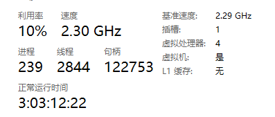
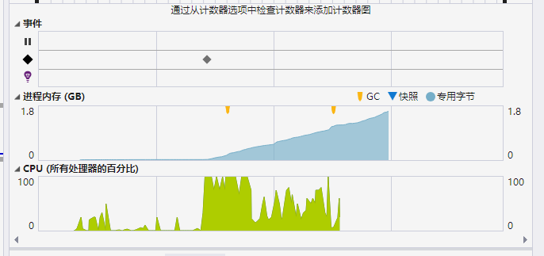

# Qos 并发和顺序

基于消费者模式和基于事件模式都是通过特性来配置消费属性，Qos 是其中一个重要的属性，Qos 默认值为 100，Qos 配置指的是一次允许消费者接收多少条未确认的消息。


### Qos 场景

对于消费者模式和事件总线模式，在没有使用 `Group` 属性配置消费行为时，每个队列都会独占一个 IConnection 以及 Host service。

对于消费频率很高但是不能并发的队列，最好不要设置 `Group` 属性，以及务必设置 `Qos = 1`。这样依赖，该消费者会独占资源进行消费，在保证顺序的情况下，独占资源有助于提高消费能力。

```csharp
[Consumer("web1", Qos = 1)]
public class MyConsumer : IConsumer<TestEvent>
{
}
```


当需要需要提高消费吞吐量，而且不需要顺序消费时，可以将 Qos 设置高一些，RabbitMQ Client 框架会通过预取等方式提高吞吐量，并且多条消息可以并发消费。


如果判断一些消费者的消费频率不会很高时，可以将这些消费者放到一个分组中。

当多个消费者或事件配置共用一个分组时，那么这些事件的 Qos 应当一致，否则按照平均值来算。

示例：

```csharp
[Consumer("web1", Qos = 10, Group = "group")]
public class My1Consumer : IConsumer<TestEvent>
{
}

[Consumer("web2", Qos = 6, Group = "group")]
public class My2Consumer : IConsumer<TestEvent>
{
}
```


由于两个消费者使用相同的分组，因此复用通道的 Qos 会被设置为 8。


如果消费频率不高，但是需要顺序消费时，可以将这些消费者放到同一个分组中，并且 Qos 设置为 1。

```csharp
[Consumer("web1", Qos = 1, Group = "group1")]
public class My1Consumer : IConsumer<TestEvent>
{
}

[Consumer("web2", Qos = 1, Group = "group1")]
public class My2Consumer : IConsumer<TestEvent>
{
}
```


### 并发和异常处理

第一次情况，Qos 为 1 时，不设置 ExecptionRequeue 、RetryFaildRequeue。

第二种情况，Qos 为 1 时，设置 ExecptionRequeue 、RetryFaildRequeue。


Qos 为 1 时，会保证严格顺序消费，ExecptionRequeue 、RetryFaildRequeue 会影响失败的消息是否会被放回队列，如果放回队列，下一次消费会继续消费之前失败的消息。如果错误（如 bug）得不到解决，则会出现消费、失败、放回队列、重新消费这样的循环。


第三次情况，Qos > 1 时，不设置 ExecptionRequeue 、RetryFaildRequeue。

第四种情况，Qos > 1 时，设置 ExecptionRequeue 、RetryFaildRequeue。


当 Qos 大于 1 时，如果设置了  `RetryFaildRequeue = true`，那么消费失败的消息会被放回队列中，但是不一定下一次会立即重新消费该条消息。


### 如何设置 Qos 

Maomi.MQ.RabbitMQ 中的 Qos 指 prefetch_count，取值范围是 0-65535，为 0 时指不限制，一般默认设置为 100 即可。

Qos 不等于消费者并发线程数量，而是指一次可以接收的未经处理的消息数量，消费者可以一次性拉取 N 条，然后逐个消费。


根据官方 [Finding bottlenecks with RabbitMQ 3.3 | RabbitMQ](https://www.rabbitmq.com/blog/2014/04/14/finding-bottlenecks-with-rabbitmq-3-3) 文档显示，预取数量对象会影响消费者的队列利用率。

| Prefetch limit预取限制 | Consumer utilisation消费者使用率 |
| ---------------------- | -------------------------------- |
| 1                      | 14%                              |
| 3                      | 25%                              |
| 10                     | 46%                              |
| 30                     | 70%                              |
| 1000                   | 74%                              |


一般情况下需要开发者中综合各类因素去配置 Qos，应当综合考虑机器网络带宽、每条消息的大小、发布消息的频率、估算程序整体占用的资源、服务实例等情况。

当程序需要严格顺序消费时，可以设置为 1。

如果在内网连接 RabbitMQ 可以无视网络带宽限制，消息的内容十分大、需要极高的并发量时，可以设置 Qos = 0。当 Qos = 0 时，RabbitMQ.Client 会尽可能吃掉机器的性能，请谨慎使用。


### Qos 和消费性能测试

下面设置不同 Qos 消费 100w 条消息的代码，在启动消费者之前， RabbitMQ 服务器中就已经存在 100w 条数据。

定义事件：

```csharp
public class TestEvent
{
    public int Id { get; set; }
    public string Message { get; set; }
    public int[] Data { get; set; }

    public override string ToString()
    {
        return Id.ToString();
    }
}
```


QosPublisher 项目的消息发布者代码如下：


```csharp
int totalCount = 0;
List<Task> tasks = new();
var message = string.Join(",", Enumerable.Range(0, 100));
var data = Enumerable.Range(0, 100).ToArray();
for (var i = 0; i < 10; i++)
{
	var task = Task.Factory.StartNew(async () =>
	{
		var singlePublisher = _messagePublisher.CreateSingle();

		for (int k = 0; k < 100000; k++)
		{
			var count = Interlocked.Increment(ref totalCount);
			await singlePublisher.PublishAsync(queue: "qos", message: new TestEvent
			{
				Id = count,
				Message = message,
				Data = data
			});
		}
	});
	tasks.Add(task);
}

await Task.WhenAll(tasks);
```


现在服务器已经有 100w 条消息了。


创建消费者项目 QosConsole，人为给消费者增加 50ms 的耗时，消息内容约 800 byte，小于 1k。


```csharp
class Program
{
    static async Task Main()
    {
        var host = new HostBuilder()
            .ConfigureLogging(options =>
            {
                options.AddConsole();
                options.AddDebug();
            })
            .ConfigureServices(services =>
            {
                services.AddMaomiMQ(options =>
                {
                    options.WorkId = 1;
                    options.AppName = "myapp-consumer";
                    options.Rabbit = (options) =>
                    {
                        options.HostName = "10.1.0.4";
                        options.ClientProvidedName = Assembly.GetExecutingAssembly().GetName().Name;
                    };
                }, new System.Reflection.Assembly[] { typeof(Program).Assembly });

            }).Build();

        Console.WriteLine($"启动时间:{DateTime.Now}");
        await host.RunAsync();
    }
}


[Consumer("qos", Qos = 30)]
public class QosConsumer : IConsumer<TestEvent>
{
    private static int Count = 0;
    public async Task ExecuteAsync(EventBody<TestEvent> message)
    {
        Interlocked.Increment(ref Count);
        Console.WriteLine($"date time:{DateTime.Now},id:{message.Body.Id}, count:{Count}");
        await Task.Delay(50);
    }

    public Task FaildAsync(Exception ex, int retryCount, EventBody<TestEvent>? message)
    {
        return Task.CompletedTask;
    }

    public Task<bool> FallbackAsync(EventBody<TestEvent>? message)
    {
        return Task.FromResult(true);
    }
}
```


为了有直观的对比，这里也直接使用 RabbitMQ.Client 编写原生消费者项目 RabbitMQConsole。

```csharp
static async Task Main()
{
	ConnectionFactory connectionFactory = new ConnectionFactory
	{
		HostName = "10.1.0.4"
	};

	var connection = await connectionFactory.CreateConnectionAsync();
	var channel = await connection.CreateChannelAsync();

	var consumer = new EventingBasicConsumer(channel);
	await channel.BasicQosAsync(prefetchSize: 0, prefetchCount: 30, global: true);

	consumer.Received += async (sender, eventArgs) =>
	{
		Dictionary<string, object> loggerState = new() { { DiagnosticName.Activity.Consumer, "Queue" } };
		if (eventArgs.BasicProperties.Headers?.TryGetValue(DiagnosticName.Event.Id, out var eventId) == true)
		{
			loggerState.Add(DiagnosticName.Event.Id, eventId!);
		}

		var testEvent = System.Text.Json.JsonSerializer.Deserialize<EventBody<TestEvent>>(eventArgs.Body.Span);
		Console.WriteLine($"start time:{DateTime.Now} {testEvent.Body.Id}");
		await Task.Delay(50);
		await channel.BasicAckAsync(eventArgs.DeliveryTag, false);
	};

	await channel.BasicConsumeAsync(
		queue: "qos",
		autoAck: false,
		consumer: consumer);

	while (true)
	{
		await Task.Delay(10000);
	}
}
```


Maomi.MQ.RabbitMQ 是基于 RabbitMQ.Client 进行封装的，Maomi.MQ.RabbitMQ 消费时需要记录日志、增加可观测性信息、构建新的依赖注入容器 等，因此耗时和资源消耗肯定会比 RabbitMQ.Client 多一些，因此需要将两者对比一下。


以 Release 发布程序，然后启动十个进程。

```csharp
using System.Diagnostics;

async Task Main()
{
    // RabbitMQConsole
	var psi = new ProcessStartInfo(@"QosConsole.exe")
	{
		UseShellExecute = true,
		CreateNoWindow = false
	};

	List<Task> tasks = new();

	for (int i = 0; i < 10; i++)
	{
		var task = async () =>
		{
			var ps = Process.Start(psi);
			await ps.WaitForExitAsync();
		};
		tasks.Add(task.Invoke());
	}

	await Task.WhenAll(tasks);
}

```


笔者使用的是 Windows 虚拟机，性能不高。




从下图可以看到，由于笔者的虚拟机 CPU 性能不高，程序在处理消息时需要进行反序列化，这一步非常消耗 CPU 性能，其实内存也一直在上升，只是在任务管理器里面没那么直观。当然，进程数量并不是越多消费越快。另外，由于 RabbitMQ 的分配机制以及客户端程序的性能，有的消费者可能会很快就消费完毕，有的消费者在后面很长一段时间内继续处理消息。


直接在 VS 里面观察，会发现内存会持续上升。



一开始笔者以为是自己的代码问题，后来经过排查，发现是 RabbitMQ 自身的原因，可以参考 RabbitMQConsole 中的示例。


下面来看不同 Qos 值对应的消费速度。

> 以下时间包括了启动 10 个进程的时间，大概需要 15s 才能启动完毕所有进程。

| Qos  | RabbitMQ.Client | Maomi.MQ.RabbitMQ |
| ---- | --------------- | ----------------- |
| 0    | 140s            | 230s              |
| 30   | 300s            | 230s              |
| 100  | 140s            | 220s              |
| 1000 | 150s            | 210s              |


根据以上测试结果可以发现，Qos = 100 时，消费速度最快，大于 100 时基本没有什么提升了。

Qos = 30 时，RabbitMQ.Client 比 Maomi.MQ.RabbitMQ 还慢，一开始觉得不合理，测试了好几次都是 RabbitMQ.Client 更慢一些。原因是多 10 个进程消耗的资源比较大，并且 RabbitMQ 要分配推送消息到 10 个进程的速度也不够快，Maomi.MQ.RabbitMQ 快一些的原因在于某些进程消费到 6w多之后就不再消费了，RabbitMQ 只给其他进程推送，反而速度快多了。


因为笔者的虚拟机性能比较差，因此 CPU 瓶颈会严重干扰测试，因此以上测试结果并不严谨。

