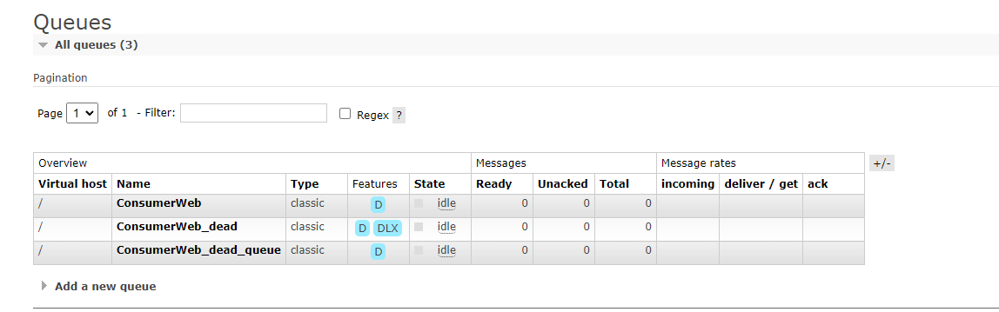

# 死信队列

可以给一个消费者或事件绑定死信队列，当该队列的消息失败后并且不会放回队列时，该消息会被推送到死信队列中，示例：


```csharp
[Consumer("ConsumerWeb_dead", Qos = 1, DeadQueue = "ConsumerWeb_dead_queue", RetryFaildRequeue = false)]
public class DeadConsumer : IConsumer<DeadEvent>
{
	// 消费
	public Task ExecuteAsync(EventBody<DeadEvent> message)
	{
		Console.WriteLine($"事件 id:{message.Id}");
		throw new OperationCanceledException();
	}

	// 每次失败时被执行
	public Task FaildAsync(Exception ex, int retryCount, EventBody<DeadEvent>? message) => Task.CompletedTask;

	// 最后一次失败时执行
	public Task<bool> FallbackAsync(EventBody<DeadEvent>? message) => Task.FromResult(false);
}

// ConsumerWeb_dead 消费失败的消息会被此消费者消费。
[Consumer("ConsumerWeb_dead_queue", Qos = 1)]
public class DeadQueueConsumer : IConsumer<DeadQueueEvent>
{
	// 消费
	public Task ExecuteAsync(EventBody<DeadQueueEvent> message)
	{
		Console.WriteLine($"死信队列，事件 id:{message.Id}");
		return Task.CompletedTask;
	}

	// 每次失败时被执行
	public Task FaildAsync(Exception ex, int retryCount, EventBody<DeadQueueEvent>? message) => Task.CompletedTask;

	// 最后一次失败时执行
	public Task<bool> FallbackAsync(EventBody<DeadQueueEvent>? message) => Task.FromResult(false);
}

```




如果使用死信队列，则务必将 `RetryFaildRequeue` 设置为 false，那么消费者会在重试多次失败后，向 RabbitMQ 发送 nack 信号，RabbitMQ 就会将该消息转发到绑定的死信队列中。


### 延迟队列

创建一个消费者，继承 EmptyConsumer，那么该队列会在程序启动时被创建，但是不会创建 IConnection 进行消费。然后设置队列消息过期时间以及绑定死信队列，绑定的死信队列既可以使用消费者模式实现，也可以使用事件模式实现。


```csharp
[Consumer("ConsumerWeb_dead_2", Expiration = 6000, DeadQueue = "ConsumerWeb_dead_queue_2")]
public class EmptyDeadConsumer : EmptyConsumer<DeadEvent>
{
}

// ConsumerWeb_dead 消费失败的消息会被此消费者消费。
[Consumer("ConsumerWeb_dead_queue_2", Qos = 1)]
public class Dead_2_QueueConsumer : IConsumer<DeadQueueEvent>
{
    // 消费
    public Task ExecuteAsync(EventBody<DeadQueueEvent> message)
    {
        Console.WriteLine($"事件 id:{message.Id} 已到期");
        return Task.CompletedTask;
    }

    // 每次失败时被执行
    public Task FaildAsync(Exception ex, int retryCount, EventBody<DeadQueueEvent>? message) => Task.CompletedTask;

    // 最后一次失败时执行
    public Task<bool> FallbackAsync(EventBody<DeadQueueEvent>? message) => Task.FromResult(false);
}
```


例如，用户下单之后，如果 15 分钟之内没有付款，那么消息到期时，自动取消订单。

