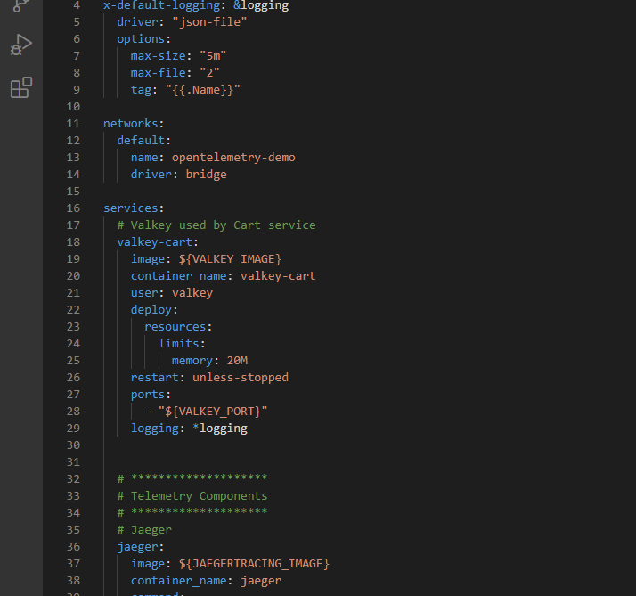
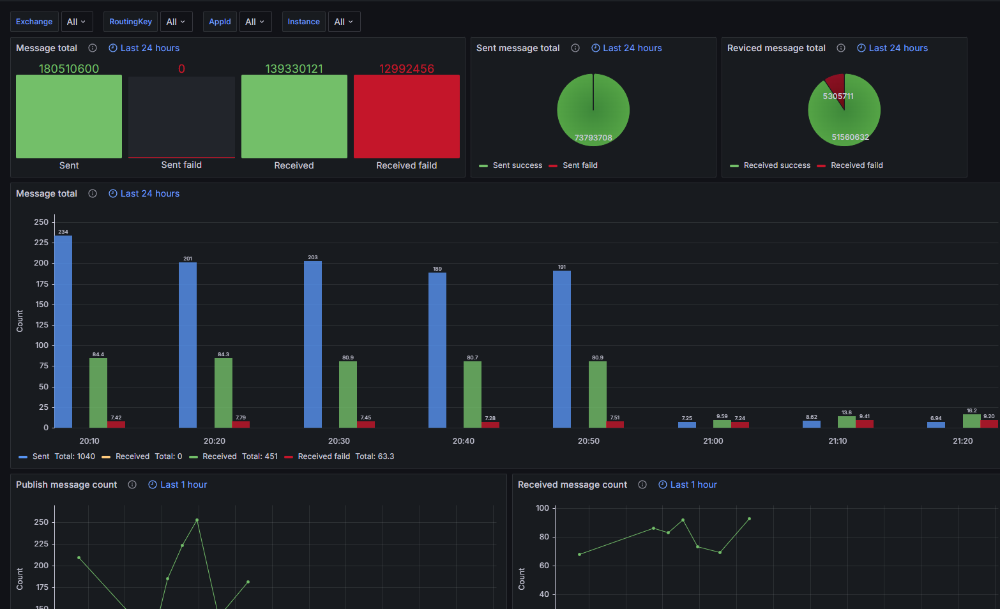

# 可观测性

请参考 ActivitySourceApi 、OpenTelemetryConsole 示例。


### 部署环境

为了快速部署可观测性平台，可以使用 OpenTelemetry 官方提供的示例包快速部署相关的服务，里面包含了 Prometheus、Grafana、Jaeger 等中间件。

open-telemetry 官方集成项目地址：https://github.com/open-telemetry/opentelemetry-demo


下载示例仓库源码：

```csharp
git clone -b 1.12.0 https://github.com/open-telemetry/opentelemetry-demo.git
```

> 请注意，不要下载 main 分支，因为有可能带有 bug。
>
> 可以把版本号设置为最新的版本。


由于 `docker-compose.yml` 示例中会包含大量的 demo 微服务，我们只需要基础设施即可因此我们需要打开 docker-compose.yml 文件，将 services 节点的 `Core Demo Services` 和 `Dependent Services` 只保留 valkey-cart，其它直接删除。或者直接点击下载笔者已经修改好的版本替换到项目中： [docker-compose.yml](opentelemetry/docker-compose.yml) 

> 注意，不同版本可能不一样。




执行命令部署可观测性服务：

```bash
docker-compose up -d
```


opentelemetry-collector-contrib 用于收集链路追踪的可观测性信息，有 grpc 和  http 两种，监听端口如下：

| Port | Protocol | Endpoint     | Function                                                     |
| :--- | :------- | :----------- | :----------------------------------------------------------- |
| 4317 | gRPC     | n/a          | Accepts traces in [OpenTelemetry OTLP format ](https://github.com/open-telemetry/opentelemetry-proto/blob/main/docs/specification.md) (Protobuf). |
| 4318 | HTTP     | `/v1/traces` | Accepts traces in [OpenTelemetry OTLP format ](https://github.com/open-telemetry/opentelemetry-proto/blob/main/docs/specification.md) (Protobuf and JSON). |

> 经过容器端口映射后，对外端口可能不是 4317、4318 了。


引入 Maomi.MQ.Instrumentation 包，以及其它相关 OpenTelemetry 包。

```csharp
<PackageReference Include="Maomi.MQ.Instrumentation " Version="1.1.0" />
<PackageReference Include="OpenTelemetry.Exporter.Console" Version="1.8.1" />
<PackageReference Include="OpenTelemetry.Exporter.OpenTelemetryProtocol" Version="1.8.1" />
<PackageReference Include="OpenTelemetry.Extensions.Hosting" Version="1.8.1" />
<PackageReference Include="OpenTelemetry.Instrumentation.AspNetCore" Version="1.8.1" />
```


引入命名空间：

```csharp
using OpenTelemetry.Logs;
using OpenTelemetry.Metrics;
using OpenTelemetry.Resources;
using OpenTelemetry.Trace;
using Maomi.MQ;
using OpenTelemetry.Exporter;
using RabbitMQ.Client;
using System.Reflection;
using OpenTelemetry;
```


注入链路追踪和监控，自动上报到 Opentelemetry。

```csharp
builder.Services.AddOpenTelemetry()
	  .ConfigureResource(resource => resource.AddService(serviceName))
	  .WithTracing(tracing =>
	  {
		  tracing.AddMaomiMQInstrumentation(options =>
		  {
			  options.Sources.AddRange(MaomiMQDiagnostic.Sources);
			  options.RecordException = true;
		  })
		  .AddAspNetCoreInstrumentation()
		  .AddOtlpExporter(options =>
		  {
			  options.Endpoint = new Uri(Environment.GetEnvironmentVariable("OTLPEndpoint")! + "/v1/traces");
			  options.Protocol = OtlpExportProtocol.HttpProtobuf;
		  });
	  })
	  .WithMetrics(metrices =>
	  {
		  metrices.AddAspNetCoreInstrumentation()
		  .AddMaomiMQInstrumentation()
		  .AddOtlpExporter(options =>
		  {
			  options.Endpoint = new Uri(Environment.GetEnvironmentVariable("OTLPEndpoint")! + "/v1/metrics");
			  options.Protocol = OtlpExportProtocol.HttpProtobuf;
		  });
	  });

```


### 链路追踪

启动 ActivitySourceApi  服务后，进行发布、消费，链路追踪信息会被自动推送到 OpenTelemetry Collector 中，通过 Jaeger 、Skywalking 等组件可以读取出来。


打开映射了 16686 端口的 Jaejer ui 面板：


由于 publish、consumer 属于兄弟 trace 而不是同一个 trace，因此需要通过 Tags 查询相关联的 trace，格式 `event.id=xxx`。


### 监控

Maomi.MQ 内置了以下指标：

| 名称                                          | 说明                 |
| --------------------------------------------- | -------------------- |
| maomimq_consumer_message_pull_count_total     | 已拉取的消息条数     |
| maomimq_consumer_message_faild_count_total    | 消费失败的消息数量   |
| maomimq_consumer_message_received_Byte_bucket |                      |
| maomimq_consumer_message_received_Byte_count  |                      |
| maomimq_consumer_message_received_Byte_sum    | 接收到的消息总字节数 |
| maomimq_publisher_message_count_total         | 发送的消息数量       |
| maomimq_publisher_message_faild_count_total   | 发送失败的消息数量   |
| maomimq_publisher_message_sent_Byte_bucket    |                      |
| maomimq_publisher_message_sent_Byte_count     |                      |
| maomimq_publisher_message_sent_Byte_sum       | 发送的消息的总字节数 |


接着，要将数据显示到 Grafana 中。

下载模板文件：  [maomi.json](opentelemetry/maomi.json) 

然后在 Grafana 面板的 Dashboards 中导入文件，可以在面板中查看当前所有服务的消息队列监控。





### 开源项目代码引用

`OpenTelemetry.Instrumentation.MaomiMQ` 项目的 Includes 代码来源于 https://github.com/open-telemetry/opentelemetry-dotnet-contrib/tree/main/src/Shared

