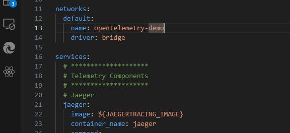
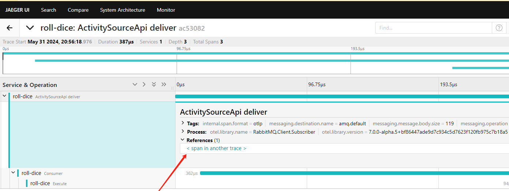

# 可观测性

内容等待完善。


请参考 ActivitySourceApi 示例。

```csharp
git clone https://github.com/open-telemetry/opentelemetry-demo.git
```


打开 [docker-compose.yml](https://github.com/open-telemetry/opentelemetry-demo/blob/main/docker-compose.yml) 文件， services 节点的一些服务，直接删除到 Jaeger 这个位置。




执行命令部署：

```csharp
docker-compose up -d
```


OpenTelemetry 默认使用 Jaeger-all-one 出来链路追踪数据，有 grpc 和  http 两种，监听端口如下：

| Port | Protocol | Endpoint     | Function                                                     |
| :--- | :------- | :----------- | :----------------------------------------------------------- |
| 4317 | gRPC     | n/a          | Accepts traces in [OpenTelemetry OTLP format ](https://github.com/open-telemetry/opentelemetry-proto/blob/main/docs/specification.md) (Protobuf). |
| 4318 | HTTP     | `/v1/traces` | Accepts traces in [OpenTelemetry OTLP format ](https://github.com/open-telemetry/opentelemetry-proto/blob/main/docs/specification.md) (Protobuf and JSON). |

> 经过容器端口映射后，对外端口可能部署 43117、4318 了。


引入 OpenTelemetry.Instrumentation.MaomiMQ 包，以及其它相关 OpenTelemetry 包。

```csharp
    <PackageReference Include="OpenTelemetry.Exporter.Console" Version="1.8.1" />
    <PackageReference Include="OpenTelemetry.Exporter.OpenTelemetryProtocol" Version="1.8.1" />
    <PackageReference Include="OpenTelemetry.Extensions.Hosting" Version="1.8.1" />
    <PackageReference Include="OpenTelemetry.Instrumentation.AspNetCore" Version="1.8.1" />
```


然后注入服务：

```csharp
const string serviceName = "roll-dice";

builder.Services.AddOpenTelemetry()
	  .ConfigureResource(resource => resource.AddService(serviceName))
	  .WithTracing(tracing =>
	  {
		  tracing.AddMaomiMQInstrumentation(options =>
		  {
			  options.RecordException = true;
		  })
		  .AddAspNetCoreInstrumentation()
		  .AddOtlpExporter(options =>
		  {
              // 端口按照映射 4318 或 4317 的填。
			  options.Endpoint = new Uri("http://127.0.0.1:32808/v1/traces");
			  options.Protocol = OtlpExportProtocol.HttpProtobuf;
		  });
	  });

builder.Services.AddMaomiMQ(options =>
{
	options.WorkId = 1;
}, options =>
{
	options.HostName = "192.168.1.4";
	options.ClientProvidedName = "aaa";
}, new System.Reflection.Assembly[] { typeof(Program).Assembly });
```


启动服务后，进行发布、消费，链路追踪信息会被自动推送到 OpenTelemetry Collector 中，通过 Jaeger 、Skywalking 等组件可以读取出来。


由于 publish、consumer 属于兄弟 trace 而不是同一个 trace，因此需要通过 Tags 查询相关联的 trace，格式 `event.id=xxx`。




### 开源项目代码引用

`OpenTelemetry.Instrumentation.MaomiMQ` 项目的 Includes 代码来源于 https://github.com/open-telemetry/opentelemetry-dotnet-contrib/tree/main/src/Shared

