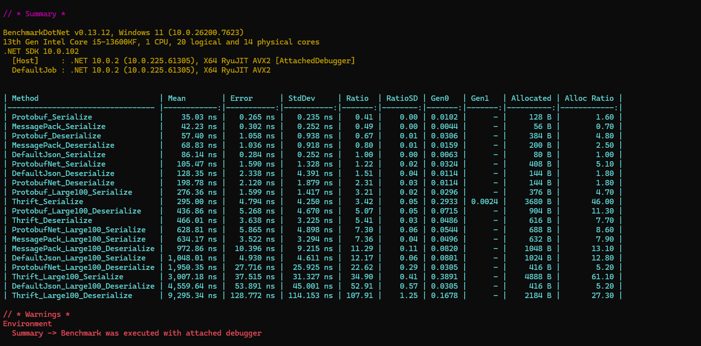

# 序列化反序列化

Maomi.MQ 目前支持五种序列化方式，分别是。

以下是这五种序列化反序列化的性能表现。

| Method                           |        Mean |      Error |     StdDev |  Ratio | RatioSD |   Gen0 |   Gen1 | Allocated | Alloc Ratio |
| -------------------------------- | ----------: | ---------: | ---------: | -----: | ------: | -----: | -----: | --------: | ----------: |
| Protobuf_Serialize               |    35.03 ns |   0.265 ns |   0.235 ns |   0.41 |    0.00 | 0.0102 |      - |     128 B |        1.60 |
| MessagePack_Serialize            |    42.23 ns |   0.302 ns |   0.252 ns |   0.49 |    0.00 | 0.0044 |      - |      56 B |        0.70 |
| Protobuf_Deserialize             |    57.40 ns |   1.058 ns |   0.938 ns |   0.67 |    0.01 | 0.0306 |      - |     384 B |        4.80 |
| MessagePack_Deserialize          |    68.83 ns |   1.036 ns |   0.918 ns |   0.80 |    0.01 | 0.0159 |      - |     200 B |        2.50 |
| DefaultJson_Serialize            |    86.14 ns |   0.284 ns |   0.252 ns |   1.00 |    0.00 | 0.0063 |      - |      80 B |        1.00 |
| ProtobufNet_Serialize            |   105.47 ns |   1.590 ns |   1.328 ns |   1.22 |    0.02 | 0.0324 |      - |     408 B |        5.10 |
| DefaultJson_Deserialize          |   128.35 ns |   2.338 ns |   4.391 ns |   1.51 |    0.04 | 0.0114 |      - |     144 B |        1.80 |
| ProtobufNet_Deserialize          |   198.78 ns |   2.120 ns |   1.879 ns |   2.31 |    0.03 | 0.0114 |      - |     144 B |        1.80 |
| Protobuf_Large100_Serialize      |   276.36 ns |   1.599 ns |   1.417 ns |   3.21 |    0.02 | 0.0296 |      - |     376 B |        4.70 |
| Thrift_Serialize                 |   295.00 ns |   4.794 ns |   4.250 ns |   3.42 |    0.05 | 0.2933 | 0.0024 |    3680 B |       46.00 |
| Protobuf_Large100_Deserialize    |   436.86 ns |   5.268 ns |   4.670 ns |   5.07 |    0.05 | 0.0715 |      - |     904 B |       11.30 |
| Thrift_Deserialize               |   466.01 ns |   3.638 ns |   3.225 ns |   5.41 |    0.03 | 0.0486 |      - |     616 B |        7.70 |
| ProtobufNet_Large100_Serialize   |   628.81 ns |   5.865 ns |   4.898 ns |   7.30 |    0.06 | 0.0544 |      - |     688 B |        8.60 |
| MessagePack_Large100_Serialize   |   634.17 ns |   3.522 ns |   3.294 ns |   7.36 |    0.04 | 0.0496 |      - |     632 B |        7.90 |
| MessagePack_Large100_Deserialize |   972.86 ns |  10.396 ns |   9.215 ns |  11.29 |    0.11 | 0.0820 |      - |    1048 B |       13.10 |
| DefaultJson_Large100_Serialize   | 1,048.01 ns |   4.930 ns |   4.611 ns |  12.17 |    0.06 | 0.0801 |      - |    1024 B |       12.80 |
| ProtobufNet_Large100_Deserialize | 1,950.35 ns |  27.716 ns |  25.925 ns |  22.62 |    0.29 | 0.0305 |      - |     416 B |        5.20 |
| Thrift_Large100_Serialize        | 3,007.18 ns |  37.515 ns |  31.327 ns |  34.90 |    0.41 | 0.3891 |      - |    4888 B |       61.10 |
| DefaultJson_Large100_Deserialize | 4,559.64 ns |  53.891 ns |  45.001 ns |  52.91 |    0.57 | 0.0305 |      - |     416 B |        5.20 |
| Thrift_Large100_Deserialize      | 9,295.34 ns | 128.772 ns | 114.153 ns | 107.91 |    1.25 | 0.1678 |      - |    2184 B |       27.30 |

介绍五种序列化反序列化组件怎么通过 nuget 引入，以及如何只需要序列化反序列化器。